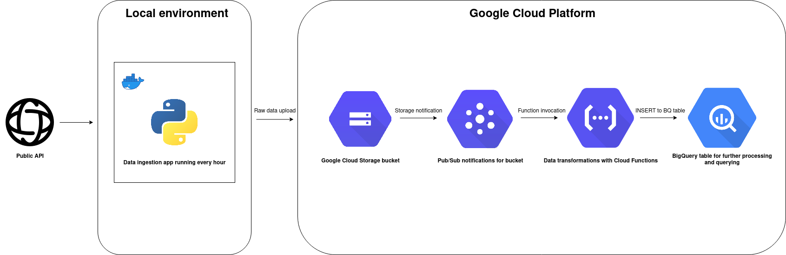

# Event-driven data pipeline

WARNING! The project is still in development. Following components will be added shortly:
1. Data ingestion app tests
2. Unified logging in Google Cloud Logging
3. Makefile for quick testing and deployment

## Design

The pipeline follows the pattern of event-driven architecture. The components look like below:
1. Simple dockerized Python app for ingesting weather data from public API.
2. Cloud Storage bucket for storing the raw data.
3. Cloud Pub/Sub topic for notifications sent by bucket to Cloud Functions
4. Cloud Functions function invoked by Pub/Sub, which accesses the raw data and applies transformations to it
5. BigQuery table for storing transformed data ready for further processing and querying



## Setup

### Prerequisite

1. Docker
2. docker-compose
3. GCP account and project with enabled billing
4. gcloud CLI

Clone and cd into the project directory.

```bash
git clone https://github.com/danevaughn/weather_data_etl
cd weather_data_etl
```

### Infrastructure set up

We have a `set_up_infra.sh` script which handles all the infrastructure set up.
The `set_up_infra.sh` script does the following:

1. Enables necessary services
2. Creates service account and custom role for it for Docker container to use
3. Generates private key and saves it in Docker's build context
4. Creates bucket to store raw data
5. Creates Pub/Sub topic which tracks new files in GCS
6. Deploys Cloud Function
7. Create BigQuery dataset
8. Spins up local Docker container for data ingestion

You can run the script like below
```
bash set_up_infra.sh <project-id> <bucket-name> <region>
```

## Clean up

`tear_down_infra.sh` script handles all the infrastructure clean up.
```
bash tear_down_infra.sh <project-id> <bucket-name> <region>
```

This will remove all the GCP services. Please ensure about this by checking in Google Cloud Console.
